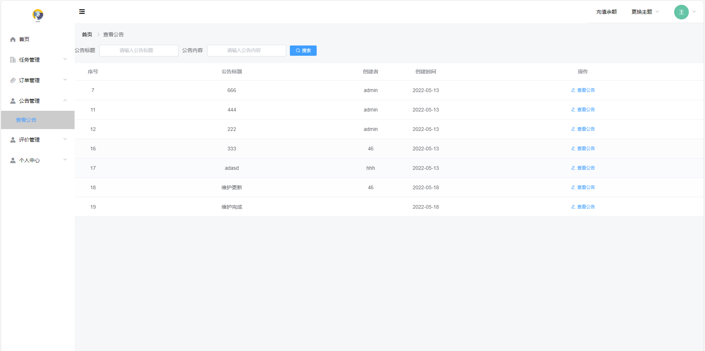

# 基于springboot+vue前后端分离的校园跑腿系统

### 9.9￥ 获取完整源码+sql，需要加Q：3808981644  或者加微信 ：qszard26
### 有问题，或者需要协助调试运行项目的也可联系
### 获取更多项目，关注公众号：编程项目集

## 一、项目介绍

开发语言：java

运行环境:idea或eclipse vscode 数据库:mysql

前端技术：vue、element-ui、axios

后端技术：springboot、mybatisplus

用户：注册、登录、首页、发布任务、接受任务、订单管理（已发布任务、已接收任务）、评价管理（我的评价、评价我的）、个人中心、余额充值

管理员：登录、首页、学校管理、用户管理、任务管理、评价管理、公告管理

## 二、部分功能界面展示

### 9.9￥ 获取完整源码+sql，需要加Q：3808981644  或者加微信 ：qszard26
### 有问题，或者需要协助调试运行项目的也可联系

